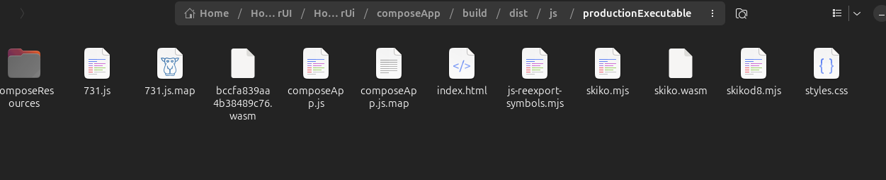

This is a Kotlin Multiplatform project targeting Web, Server.

* [/composeApp](./composeApp/src) is for code that will be shared across your Compose Multiplatform
  applications.
  It contains several subfolders:
    - [commonMain](./composeApp/src/commonMain/kotlin) is for code that’s common for all targets.
    - Other folders are for Kotlin code that will be compiled for only the platform indicated in the
      folder name.
      For example, if you want to use Apple’s CoreCrypto for the iOS part of your Kotlin app,
      the [iosMain](./composeApp/src/iosMain/kotlin) folder would be the right place for such calls.
      Similarly, if you want to edit the Desktop (JVM) specific part,
      the [jvmMain](./composeApp/src/jvmMain/kotlin)
      folder is the appropriate location.

* [/server](./server/src/main/kotlin) is for the Ktor server application.

* [/shared](./shared/src) is for the code that will be shared between all targets in the project.
  The most important subfolder is [commonMain](./shared/src/commonMain/kotlin). If preferred, you
  can add code to the platform-specific folders here too.

### Build and Run Server

To build and run the development version of the server, use the run configuration from the run
widget
in your IDE’s toolbar or run it directly from the terminal:

- on macOS/Linux
  ```shell
  ./gradlew :server:run
  ```

  ```shell
  ./gradlew kotlinWasmUpgradeYarnLock
  ```

 ```shell
./gradlew kotlinWasmUpgradeYarnLock
 ```

  ```shell
  ./gradlew run
  ```

- on Windows
  ```shell
  .\gradlew.bat :server:run
  ```

### Build and Run Web Application

To build and run the development version of the web app, use the run configuration from the run
widget
in your IDE's toolbar or run it directly from the terminal:

- for the Wasm target (faster, modern browsers):
    - on macOS/Linux
      ```shell
      ./gradlew :composeApp:wasmJsBrowserDevelopmentRun
      ```
    - on Windows
      ```shell
      .\gradlew.bat :composeApp:wasmJsBrowserDevelopmentRun
      ```
- for the JS target (slower, supports older browsers):
    - on macOS/Linux
      ```shell
      ./gradlew :composeApp:jsBrowserDevelopmentRun
      ```
    - on Windows
      ```shell
      .\gradlew.bat :composeApp:jsBrowserDevelopmentRun
      ```

---

```shell
./gradlew :composeApp:jsBrowserDistribution
```

#Install caddy on server and setup(face redirect la 8085 deja..)
curl -k https://homestreambox.go.ro/get


# start UI
(run build from compose app -> )
python3 -m http.server 8086 --bind 127.0.0.1

# Setup ui for caddy...
# for server
handle /ui/* {
reverse_proxy 127.0.0.1:8086
}

#restart caddy
sudo caddy validate --config /etc/caddy/Caddyfile
sudo systemctl restart caddy

# Caddyfile
homestreambox.go.ro {
tls iosifdaniel07@yahoo.com

    # Proxy the root domain to port 8085
    reverse_proxy 127.0.0.1:8087 # UI

    handle /api/* {
        reverse_proxy 127.0.0.1:8085 # Server
    }
}

# setup ufw
`sudo ufw status
sudo ufw allow 8090/tcp
sudo ufw allow 80
sudo ufw allow 443
sudo ufw reload`


#start server
curl -k https://homestreambox.go.ro/api/get

@SFTP
sftp -P 2222 iosifdaniel07@homestreambox.go.ro
ssh -p 2222 iosifdaniel07@homestreambox.go.ro

Learn more
about [Kotlin Multiplatform](https://www.jetbrains.com/help/kotlin-multiplatform-dev/get-started.html),
[Compose Multiplatform](https://github.com/JetBrains/compose-multiplatform/#compose-multiplatform),
[Kotlin/Wasm](https://kotl.in/wasm/)…

We would appreciate your feedback on Compose/Web and Kotlin/Wasm in the public Slack
channel [#compose-web](https://slack-chats.kotlinlang.org/c/compose-web).
If you face any issues, please report them
on [YouTrack](https://youtrack.jetbrains.com/newIssue?project=CMP).